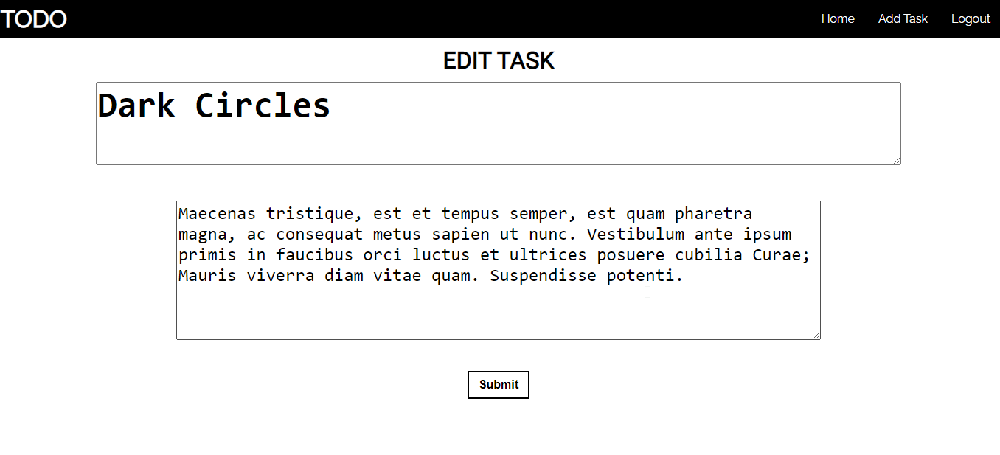

# PHP TODO List App

## Requirements

- [x] User registration and login
- [x] Add new tasks with a title and description.
- [x] View all tasks in a table.
- [x] Delete existing tasks.
- [x] Mark tasks as complete
- [x] User logout

## Installation

- Install the XAMMP Control Panel.
- Navigate to your `C drive` for windows, the `C:\xampp\htdocs`.
- Copy the folder with it's correct naming.
- Open up the XAMMP Control Panel and start Apache and MySQL.
- Open MySQL Admin Panel and create a database name **todo_db**. *You must use that as the database name*
- On your browser enter the following link to access the app [http://localhost/todo-app](http://localhost/todo-app)

## Usage

- You need to run the `todo_db.sql` file provided to create and populate the database.
- You can now access the site using the login details from the database or you can create yours.
- If you wish to use the prepopulated login details, you can use the following `username: tkainec` `password:j55oo5`.
- If you wish to create your own login details. You will navigate to the login page and then click register to access the Registration form. On registration you will be prompted to enter your login details to access the site.
- You will be taken to the homepage where you can add a new task from the navbar.
- On the home page, clicking the Task title opens up the description of the task and clicking it again closes it.
- A task can be marked as complete or unmarked as completed on the home page using the checkbox.
- The edit button allows you to change the the title and description of a task.
- The logout button is on the top right corner and it will log you out of your account.

## Testing

- The app has been tested throughly by my peers. 
- Issues relating to the session management when pages were switched occured.
- These issues have been solved and the app is able to meet all it functionality

## App Demo

#### Login Page

#### Home Page

#### Create Task Page

#### Edit Page

#### Wakatime Page
This page shows the Wakatime dashboard of the hours put into this project

